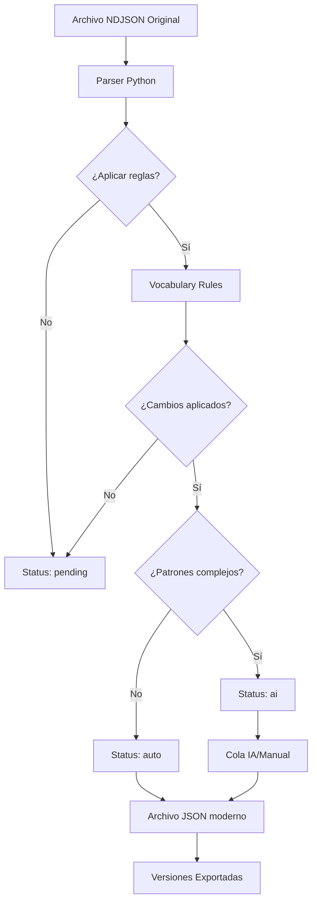

# Plan de Modernización RV1909 → Español Contemporáneo

## Visión General del Proyecto

Este proyecto tiene como objetivo convertir la Biblia Reina Valera 1909 (RV1909) a español contemporáneo manteniendo la fidelidad al texto original y las referencias bíblicas (Strong).

## Estado Actual del Proyecto

| Componente | Estado | Notas |
|------------|--------|-------|
| [`scripts/parser.py`](scripts/parser.py) | ⚠️ Parcial | Aplica algunas reglas pero no todas |
| [`data/vocabulary_modernization.json`](data/vocabulary_modernization.json) | ✅ Básico | Define reglas de modernización |
| [`data/strong_mapping.json`](data/strong_mapping.json) | ⚠️ Incompleto | Solo 1 mapping completado |
| [`verses/`](verses/) | ⚠️ Parcial | Solo ~150 versículos de prueba |

---

## Fases del Proyecto

### Fase 1: Foundation (Semana 1-2)

#### 1.1 Corregir Parser Automático
- [ ] **Depurar aplicación de reglas**: El parser debe aplicar correctamente mayúsculas, tildes históricas y pronombres arcaicos
- [ ] **Mejorar logging**: Agregar más detalles sobre los cambios realizados
- [ ] **Agregar pruebas unitarias**: Verificar que las reglas se aplican correctamente
- [ ] **Manejo de errores robusto**: Mejorar manejo de archivos faltantes o corruptos

#### 1.2 Completar Vocabulario de Modernización
- [ ] **Expandir reglas de puntuación**: Revisar puntos, comas, dos puntos
- [ ] **Agregar palabras compuestas**: "aun" → "aún", "porque" → "porque"
- [ ] **Completar pronombres**: Todos los pronombres arcaicos
- [ ] **Verificar palabras comunes**: Completar mapeos en `common_words`

#### 1.3 Completar Mapeo Strong
- [ ] **Completar Genesis 1**: Agregar todos los versículos del capítulo 1
- [ ] **Iniciar AT completo**: Comenzar con los libros principales (Génesis, Éxodo, etc.)
- [ ] **Iniciar NT completo**: Agregar mappings del Nuevo Testamento

---

### Fase 2: Procesamiento Automatizado (Semana 3-4)

#### 2.1 Procesar Todo el Antiguo Testamento
- [ ] **Libros históricos**: Génesis - Ester (22 libros)
- [ ] **Libros poéticos**: Job - Cantares (5 libros)
- [ ] **Profetas mayores**: Isaías - Daniel (5 libros)
- [ ] **Profetas menores**: Oseas - Malaquías (12 libros)

#### 2.2 Procesar Todo el Nuevo Testamento
- [ ] **Evangelios**: Mateo - Juan (4 libros)
- [ ] **Historiabcn**: Hechos (1 libro)
- [ ] **Epístolas paulinas**: Romanos - Hebreos (13 libros)
- [ ] **Epístolas generales**: Santiago - Judas (7 libros)
- [ ] **Profecía**: Apocalipsis (1 libro)

#### 2.3 Pipeline Automatizado
- [ ] **Script batch processing**: Procesar todos los versículos automáticamente
- [ ] **Generación de estadísticas**: Cuántos cambios por libro
- [ ] **Reportes de progreso**: Dashboard de modernización

---

### Fase 3: Revisión y IA (Semana 5-8)

#### 3.1 Identificación de Patrones Complejos
- [ ] **Ejecutar detector de patrones complejos**: Los que requieren análisis contextual
- [ ] **Categorizar por tipo**: 
  - Contexto teológico (carne, espíritu, sangre)
  - Contexto técnico (pecado, error)
  - Contexto cultural (prójimo,邻居)
- [ ] **Generar lista de revisión**: Versículos que necesitan revisión manual

#### 3.2 Integración de IA para Revisión Contextual
- [ ] **Configurar modelo de IA**: Para análisis contextual
- [ ] **Procesamiento por lotes**: Aplicar IA a patrones complejos
- [ ] **Revisión humana**: Verificar sugerencias de IA

#### 3.3 Validación de Calidad
- [ ] **Verificación de consistencia**: Mismas palabras en mismo contexto
- [ ] **Pruebas de lectura**: Verificar fluidez del texto modernizado
- [ ] **Comparación con otras versiones**: RV1960, NVI, LBLA

---

### Fase 4: Distribución y Documentación (Semana 9-10)

#### 4.1 Exportación y Formatos
- [ ] **Generar NDJSON final**: Archivo con todos los versículos modernizados
- [ ] **Exportar a múltiples formatos**: 
  - JSON estructurado
  - Markdown por libro
  - HTML
  - PDF (opcional)
- [ ] **Versionado semántico**: Tagged releases

#### 4.2 Documentación Técnica
- [ ] **README completo**: Guía de uso del proyecto
- [ ] **API Documentation**: Si hay endpoints
- [ ] **Changelog**: Registro de cambios por versión

#### 4.3 Repositorio Git
- [ ] **Estructura de ramas**: 
  - `main`: Versión estable
  - `develop`: Desarrollo
  - `feature/*`: Nuevas funcionalidades
- [ ] **CI/CD**: Pipeline de integración continua
- [ ] **Licencia y metadata**: Información legal

---

## Diagrama de Flujo del Pipeline



---

## Archivos y Estructura del Proyecto

```
RV1909KILO/
├── data/
│   ├── vocabulary_modernization.json    # Reglas de modernización
│   └── strong_mapping.json              # Mapeo de referencias Strong
├── scripts/
│   └── parser.py                         # Script principal de procesamiento
├── verses/                               # Versículos procesados
│   ├── GEN/001/001.json
│   ├── NEH/...
│   ├── PRO/...
│   └── PSA/...
├── docs/
│   └── (documentación adicional)
└── plans/
    └── (este archivo)
```

---

## Métricas de Progreso

| Métrica | Meta | Actual |
|---------|------|--------|
| Versículos procesados | ~31,000 | ~150 |
| Libros completados | 66 | 0 |
| Referencias Strong | ~14,000 | 1 |
| Reglas de vocabulario | 50+ | ~20 |

---

## Próximos Pasos Inmediatos

1. **Corregir el parser** para que aplique correctamente las modernizaciones
2. **Ejecutar el script** en modo dry-run para ver los cambios
3. **Procesar un libro completo** como prueba (ej. Génesis)
4. **Revisar resultados** y ajustar reglas según necesidad

---

*Plan creado: 2026-02-20*
*Proyecto: RV1909 Modernization*
